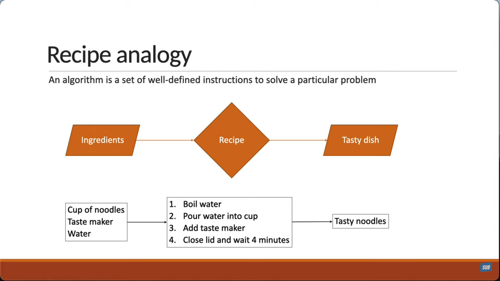
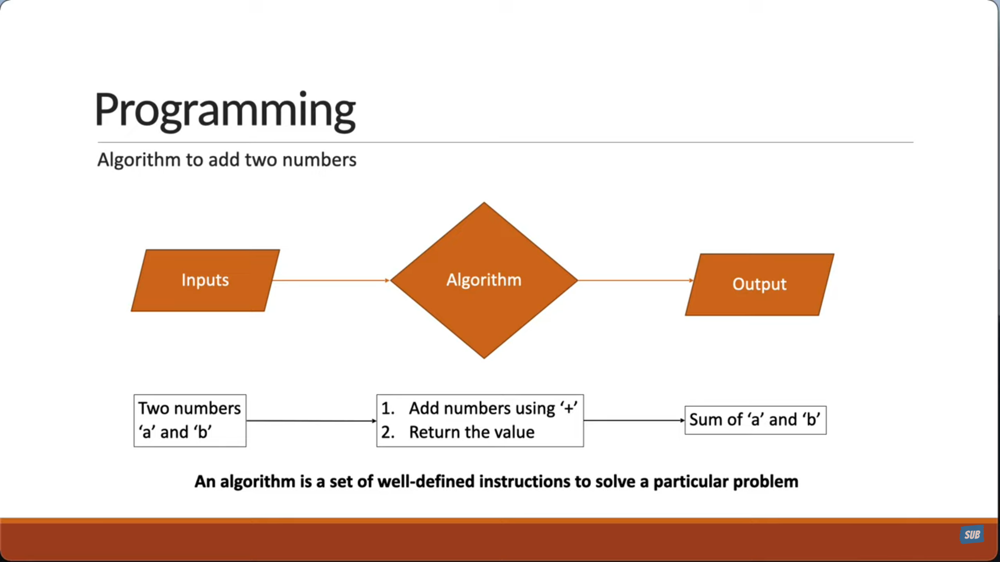
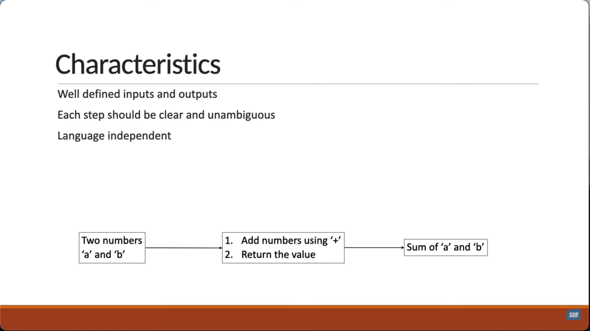

# What is an Algorithm?

Algorithm is a set of well-defined instructions to solve a praticular problem.
Reference: [YouTube](https://youtu.be/vVYG8TNN7hg?list=PLC3y8-rFHvwjPxNAKvZpdnsr41E0fCMMP&t=10).

> In computer science, a data structure is a way of organizing and storing data in a computer so that it can be accessed and used efficiently. It's a fundamental concept that defines how data is arranged, stored, and managed within a program or system, impacting how data is processed, retrieved, and maintained. Essentially, data structures are the building blocks that enable programmers to effectively handle and manipulate data to solve various computational problems.

## Here's a more detailed breakdown

1. **Organizing and Storage**
   - Data Structure provide a framework for arranging data in specific format, making it easier to manage and access.
1. **Efficiency**
   - Diffent data structures are suited for different tasks, and choosing the right one can significantly impact the performance of a program in terms of speed and memory usage.
1. **Relationship and Operations**
   - Data Strucutures define not only how data is stored but also the relationship between data elements and the operations that can be performed on them.
1. **Essential for Programming**
   - Data Structure are essential for building software applications, and understanding them is crucial for any programming.
1. **Examples:**
   - Common data structures include arrays, linked lists, stacks, queues, tress, and graphs, each with its own characteristics and use cases.

### Recipe Analogy

To simpliest real world analogy, is that of following a recipe.

1. You have a set of ingredients to cook with.
1. To prepare a dish you carefully follow the recipe and execute a steps one-by-one in a sequence.
1. The end result is a tast dish

If you're preparing an instant noodles:

1. You have:
   - `cup of noodles`,
   - `taste maker`, and
   - `water` as the ingredients.
1. For the recipe you have steps lie:
   - `boiled water`,
   - `pour water into the cup`,
   - `add taste maker`, and
   - `close the lid and wait for 4 minutes`.
1. The output is: `a cup of tasty noodles` that you can enjoy.

### Programming

> In Computer Science programming is the process of creating a set of instructions, called code, that a computer can understand and execute to perform specific tasks or solve problems. It's essentially about communicating with computers in a way they understand, to tell them what to do.

Let's extend this to computer progrmaming:

Consider an algorithm is to add two numbers. In this case, we refer to the:

- `Ingredients` as **inputs**
- the `recipe` as **algorithm** and,
- the `tasty dish` is the **output**.

In our scenario:

1. **Inputs** will be the `two numbers (E.g., 'a' and 'b')`.
1. the **algorithm** steps include `addding the numbers using the plus operator` and `returning the value`.
1. The **output** is the `sum of the two numbers`

> So we have our set of well-defined instructions to solve a particular problem which in our case is adding two numbers.

### Characteristics

An algorithm in computer science is **`characterized`** by `well-defined inputs and outputs`, `finiteness`, `definiteness`, and `effectiveness`. These characteristics ensure that the algorithm is clear, unambiguous, and can be executed to solve a specific problem.

> **Characteristic 1** : An algorithm should have `well-defined inputs and outputs.` In our example:

- We have two `numbers` as **input**,
- and `their sum` as the **output**.

There's no confussion about that.

> **Characteristic 2** : `Each step in an algorithm should be clear and unambiguous.` In our example, we have two steps:

- `Add the numbers` using the `'+'` plus operator.
- And `return the sum`.

> **Characteristic 3** : Finally, an algorithm should be language independed. It should be written in such a way that it can be used with different programming languages.

You can see that is the case with our example as well.
It is just a sequence of instructions that can be implemented in any language.
Although, I had mentioned we woudl be using JavaScript to write our code. The algorithm itself is by no means related to JavaScript.

### Why Should you learn Algorithms?

> - Well `as a developer, you're going to come across problems that you need to solve.`
> - When you learn about algorithms, you basically, `learning algorithms translates to learning different techniques to efficiently solve those problems.`
> - This last a bit important to keep in mind. `One problem can be solved in many ways using different algorithms.`
> - And `every algorithm comes with its own tradeoffs when it comes to performance.` Which begs the question: **How do we measure an algorithm?** Well, we will discuss it in the next topic.

---

#### Additional Answer

Answer by AI Overview:

Learning algorithms is curcial for `developing strong problem-solving skills, improving coding efficiency, and understanding the fundamentals of computer science.` They are essential for building robust, saclable, and efficient software, and frequently used in various real-world applications, including search engines, machine learning, and more.

Here's a more detail look at the benefits:

1. Enhances Problem-Solving Skills:
   - Algorithms provide a structured approach to solving problems, breaking them down into smaller, manageable steps.
   - This structured thinking can be applied to various aspects of life, not just programming.
   - Learning algorithms helps develop logical reasoning and analytical skills.
2. Improves Coding Efficiency:
   - Algorithms are designed to optimize performance, allowing programs to run faster and use fewer resources.
   - Understanding algorithms enables you to write more efficient code and make informed decisions about data structures and algorithms.
   - This is particularly important when dealing with large datasets or complex problems.
3. Essential for Job Interviews and Careers:
   - Many tech companies use algorithmic challenges in their interview processes.
   - Strong knowledge of algorithms can significantly improve your chances of landing a job at top tech companies.
   - It's a fundamental skill for any software developer, regardless of the specific programming language or technology.
4. Facilitates Understanding of Technology:
   -Algorithms are the backbone of many technologies, including search engines, social media, and machine learning.
   - Understanding how these algorithms work allows you to better understand how technology functions and its impact on society.
   - It also helps you adapt to new technologies and programming languages.
5. Promotes Creativity and Innovation:
   - While algorithms are often associated with logic and structure, they also require creativity to develop efficient solutions.
   - By learning algorithms, you can develop your ability to think outside the box and come up with innovative solutions to complex problems.
6. Enables Solving Real-World Problems:
   - Algorithms are used to solve a wide range of real-world problems, from optimizing delivery routes to recommending products.
   - By learning algorithms, you can contribute to developing solutions to these problems and making a positive impact on the world.

##### Conclusion

> In conclusion, learning algorithms is an investment in your future as a programmer and a critical thinker. It provides you with valuable problem-solving skills, enhances your coding efficiency, and opens up a wide range of opportunities in the tech industry.
