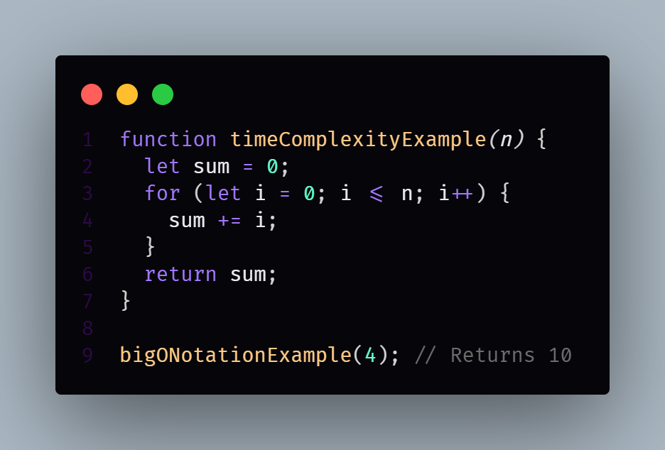

# Big-O Notation

> The `worst case complexity` of an algorithm is represented using the **Big-O Natation**.

Big-O Notation describes the complexity of an algorithm using **algebraic terms**.
_"It focuses on how the algorithm's performance scales with the input size, ignoring constant factors and lower-order terms."_

_**The Big-O Notation has two important characteristics:**_

1. It has expressed in terms of the input.
2. It focuses on the bigger picture without getting caught up in the minute details.

_Let's understand these two points under the context of time complexity._
_We can then extend that knowledge to understand space complexity._

Let's calculate the worst case time complexity of our first program. The file located at `../src/lesson-04-big-O-Notation.js`.

---

The algorithm: Is to find the sum of first n natural numbers.
We have an input n, and the functions returns the sum of all the natural numbers from 1 to n.

_For Example:_

Summation when called with `n` is equal to `4`, will return `10`.
E.i.: summation(4) = 10
1 + 2 + 3 + 4 = 10



<!-- ```javascript
function timeComplexityExample(n) {
  let sum = 0;
  for (let i = 0; i <= n; i++) {
    sum +=1
  }
  return sum;
}
``` -->

_Explanation:_

- The function iterates from 0 to n, performing a constant time operation (addition) for each iteration.
- Therefore, the time complexity is O(n), where n is the input value.
- This means that as n increases, the time taken by the function increases linearly.

---

We already know, we cannot calculate the absolute running time of an algorithm and hence that cannot be the time complexity.

What we do instead is count the number of times? A statement executes based on the input size.

_**Let's break it down.**_

Above's code/program has three main statements to execute.

- line 2
- line 4
- line 6

The `for loop` is just a `repetition of line 4`.

```javascript
function timeComplexityExample(n) {
	// n = 4
	let sum = 0; // 1
	for (let i = 0; i <= n; i++) {
		sum += 1; // 4
	}
	return sum; // 1
}

timeComplexityExample(4);
```

Now, given `n` is equal to `4`, let's calculate the number of times each statement is executed.

- line `2` executes `only once`.
- line `4` however, executes `4 times`.
  - `i` is equal to 1, `i` is equal to `4`.
- line `6` is executed `just once`.

So, the `total count` is `4 + 2`.

**4 plus 2** because we can generalize it to `n + 2`.
When `n` is `input` to the function.

If `n` = `4`, the total count is `4 + 2`.
If `n` = `10`, the total count is `10 + 2`.
If `n` = `1,000,000` the total count is `1,000,000 + 2`.

_**Our `time complexity` is dependent on the input size.**_

This is the first characteristics. **Big-0** is expressed in terms of the `input`.

---

_**n + 2**_
The Second point, it focuses on the bigger picture without getting caught up in the minute details.

```bash
n = 100 -> n + 2 = 100 + 2 = 102
n = 1000 -> n + 2 = 1000 + 2 = 1002
n = 10000 -> n + 2 = 10000 + 2 = 10002
.
.
n = 100000000 -> n + 2 = 100000000 + 2 = 100000002
```

</br>

_**`n + 2 -> n`**_
At that point, the **`n + 2`** is very insignificant.
We can actually drop it **`n`**.

`n + 2` can be approximated to just `n`. Since `n` contributes the most to the total value and not the additional 1 or 5 or 10 or other extra steps.

Or in our case, `2` extra steps. You don't get caught up in the smaller steps that don't affect the performance as much as the others.

---

So the worst case time complexity, which is also referred to as just the `time complexity` of our summation algorithm.

```javascript
function timeComplexityExample(n) {
	let sum = 0;
	for (let i = 0; i <= n; i++) {
		sum += 1;
	}
	return sum;
}

timeComplexityExample(4);
```

## Linear Time Complexity | O(n)

Our summation algorithm is `Big-O of n` or `O(n)` which is referred to as `linear time complexity`.

- `Linear Time Complexity` - What it means, is that as the size of the input increases the time complexity also increases.

- `Linear Time Complexity` - denoted as `O(n)`, means "The `time` it takes for an algorithm to complete, `increases directly proportional` to the `size` of the `input (n)`. In simple terms, if you double the input, the algorithm will roughly take twice as long to run.

Hopefully, you now have a good idea of what the Big-O Notation is.

**Now you might ask.** Do I have to calculate the count line-by-line to determine the time complexity?

Well, you could but you can also perform some safe calculations. Anytime you see a loop in your algorithm, most of the times you can safely say the time complexity is at least linear.
Of course, there are exceptions and we will look at them througout this course.
But a loop's worst case is when it iterates over the intire input and hence the time complexity is linear.

If `n = 10` the statement will be executed 10 times in the worst case.

---

## Big-O Calculation

```javascript
function summation(n) {
	return (n * (n + 1)) / 2;
}

summation();
```

Here's the another algorithm for the same problem.

Summation of first `n` natural numbers.
The time complexity of this algorithm is O(1) which called constant complexity.

**Time Complexity:**

- **O(1)** - Constant Time Complexity
  - Irrespective of what the value of `n` is line two is executed only once. Once you get the hang of it. It becomes easier to anaylze the time complexity.

_**For Example:**_

```javascript
for (let i = 1; i <= n; i++) {
	for (let j = 1; i <= i; j++) {
		// Some code
	}
}
```

- There are two nested loops. The time complexity is quadratic

**Time Complexity:**

- **O(n^2^)** - Quadratic Time Complexity
  - Once again, the Big-O Notation drops the less dominant terms. If you calculate the complexity to be:
- 3n^2^ + 5n + 1
  - We narrow that down to just `n square` and call it `quadratic`.
- Hundred million square is so large compared to five into 100 then we can drop the latter term.
- **Quadratic Time Complexity** - denoted as `O(n^2^)`, means that `the time an algorithm takes to run grows proportionally to the square of the input size (n)`. In simpler terms, if you double the input, the execution time will roughly quadruple. This often arises in algorithms with nested loops where each loop interates through the input data.

</br>

```javascript
for (i = 1; i <= n; i++) {
	for (j = 1; j <= i; j++) {
		for (k = 1; k <= j; k++) {
			// Some code
		}
	}
}
```

Now, if there are `three nested loops`. `It is Cubic Time Complexity`.

- **O(n^3^)** - Cubic Time Complexity
- **Cubic Time Complexity** - denoted as O(n^3^), means `the time it takes for an algorithm to run increases proportionally to the cube of the input size (n)`. In simpler terms, if you double the input, the execution time will roughly increase eight times. This typically arises from algorithm with three nested loops.

</br>

If the `input size` **reduces** by `half` **every iteration** it is:

- **O(logn)** - Logarithmic Time Complexity.
  - Determining the Time Complexity of the various algorithms we will be looking at throughout the series. So you will slowly but surely get the hang of it.
- Logarithmic Time Complexity - denoted as O(log n), means `the time it takes for an algorithm to complete grows proportionally to the logarithm of the input size`. Essentially, as the input grows, the number of operations increases much slower than the input size, making logarithmic time complexity very effecient, especially for large datasets.

Let's quickly talk about

## Space Complexity
